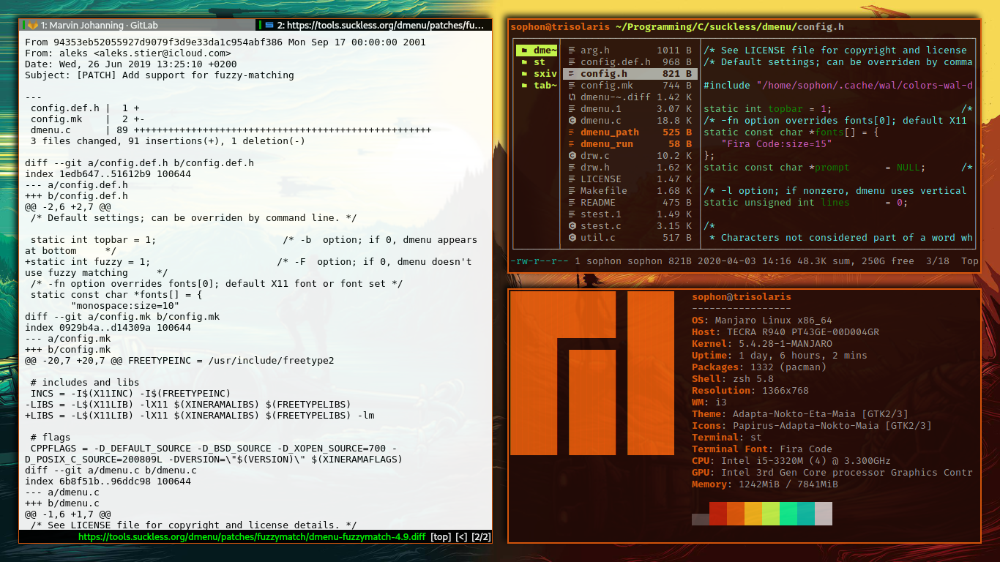

# Dotfiles

## What are dotfiles
Dotfiles are, generally, small files that, as the name would suggest, begin with a full-stop. These are generally used for the configuration of programs (especially CLI and TUI programs) and other parts of the operating system. Please be aware, however, that this repository also contains config files that technically _aren't_ dotfiles (as they don't begin with a dot). Therefore, it's best to view this repository as a collection of my most important config files.

## How can I use these files?
___Before you begin using these files, create a back-up of all your configuration files. Installing these may render your machine unsuable. Use at your own risk! I cannot be made responsible for any damage caused to your machine.___

If you wish to use these config files for yourself, I welcome you to do so! However, I use a couple of programs that you may not have installed and it's therefore important to install these before you begin. 
Afterwards, you simply clone this repository and copy the content of the resulting folder into your `~` folder, overwriting exisiting files. 

### Prerequisites
1. You need to have [i3-gaps](https://github.com/Airblader/i3) installed if you are planning on copying any of the files from the .i3 folder.
2. Vim is pre-installed on most Linux distributions, however I use Vim in the terminal. I am not sure if any of the configs work with gVim or neoVim or any of the other types of vim. (if you want to use my .vim configs)

  * To install the different Vim plugins that I use, you will need to install Vundle which can be downloaded by typing `git clone https://github.com/VundleVim/Vundle.vim.git ~/.vim/bundle/Vundle.vim` into your terminal. Afterwards, please try to run `:PluginInstall`; this should then automatically install the different plugins for you. Beware, however, that it may take a couple of seconds depending on your internet speed; it will say "Done!" when every plugin has been successfully downloaded.

3. Ranger is the file manager I use. I am not sure whether it comes pre-installed with most Linux distributions, so please check whether Ranger has been installed. (if you want to use my ranger configs)
4. [Pywal](https://github.com/dylanaraps/pywal) is highly recommended for changing backgrounds and colours on the fly (especially with my Ranger shortcut)
5. The mdv program
6. I use `neomutt` for my emails, so you'll need that as well
7. I use `rofi` as a program launcher ($mod+d)
8. I prefer to use `termite`, as it seems to have much better UTF8 support
9. If you want to get the most out of `neomutt`, I highly recommend using mutt-wizard
10. I generally use Zsh as my default Shell

  * I use a couple of extensions. To install these, please first download and install `oh-my-zsh` and then download and install`autosuggestions` and `zsh-syntax-highlighting`. Otherwise you won't be able to use my .zshrc.

### How to get my set-up
In order to use these config files, you should firstly create a backup of your current config files (I recommend using git and Github for that as well. If that is too complicated, just rename them to something like configname.copy). After having created a backup of all important config files, you simply need to replace all all your files with the ones in this repository. Some config files have my username included, which means that if you try to run said config file you will most likely run into an error. Should you run into an error when running a config file or should something not work as intended, please check the config file and see if it includes my username and remove it.

_**DISCLAIMER! USE AT OWN RISK!** I cannot be made responsible for any harm done to your computer_

## Fonts
Fonts are not included in this repository. The font I use for my Terminal (URxvt) is Adobe's _Source Code Pro_. You will need to download that yourself using your package manager.

## Keybindings
These config files also include a large number of keybindings that have been tweaked or added to my liking. When using my configuration, please be aware that the keybindings that you are used to might have been changed.
Here is a quick overview of most of the commands that have been added 

<table>
  <tr>
    <th>Program</th>
    <th>Command</th>
    <th>Function</th>
  </tr>
  <tr>
    <td>Ranger</td>
    <td>CC</td>
    <td>Pressing CC (change colour) when over an image file will start pywal using that image</td>
  </tr>
  <tr>
    <td>Ranger</td>
    <td>gPc, gDd, gDc ... (more <a href="https://github.com/Jeytas/dot/blob/master/.config/ranger/rc.conf#L322">here</a>)</td>
    <td>Pressing these button combinations will take you to a specified directory (g => goto), for example gPc => goto Pictures</td>
  </tr>
  <tr>
    <td>Ranger</td>
    <td>mvt (+directory)</td>
    <td>Pressing this button combination over any file (mvt => move to) and then specifying a directory will move said file to said directory</td>
  </tr>
  <tr>
    <td>Ranger</td>
    <td>mvPc, mvDc, mvPw...</td>
    <td>Will move selected file(s) to either ~/Pictures (mvPc), ~/Documents (mvDc) or ~/Pictures/wallpapers (mvPw)</td>
  </tr>
  <tr>
    <td>Ranger</td>
    <td>cpPc, cpDc, cpPw...</td>
    <td>Will copy selected file(s) to either ~/Pictures (mvPc), ~/Documents (mvDc) or ~/Pictures/wallpapers (mvPw)</td>
  </tr>
  <tr>
  <tr>
    <td>Ranger</td>
    <td>oM, oE, oV, oW</td>
    <td>oM parses a markdown file using mdv and displays it using w3m – the others open the selected file using Emacs, Vim or w3m respectively</td>
  </tr>
    <td>Ranger</td>
    <td>cpPc, cpDc, cpPw...</td>
    <td>Will copy selected file(s) to either ~/Pictures (mvPc), ~/Documents (mvDc) or ~/Pictures/wallpapers (mvPw)</td>
  </tr>
  <tr>
    <td>Ranger</td>
    <td>dl</td>
    <td>Will delete selected files</td>
  </tr>
  <tr>
    <td>Ranger</td>
    <td>exe mexe</td>
    <td>Start selected executeable file (exe) or make file executeable (mexe)</td>
  </tr>
  <tr>
    <td>Ranger</td>
    <td>bk</td>
    <td>Creates a backup file (filename.ending_bk) for the files selected</td>
  </tr>
  <tr>
    <td>i3-gaps</td>
    <td>Mod+Shift+P (+M)</td>
    <td>Will increase (+P) or decrease (+M) outer gap size</td>
  </tr>
  <tr>
    <td>i3-gaps</td>
    <td>Mod+CTRL+P (+M)</td>
    <td>Will increase (+P) or decrease (+M) inner gap size</td>
  </tr>
 </tr>
</table>
